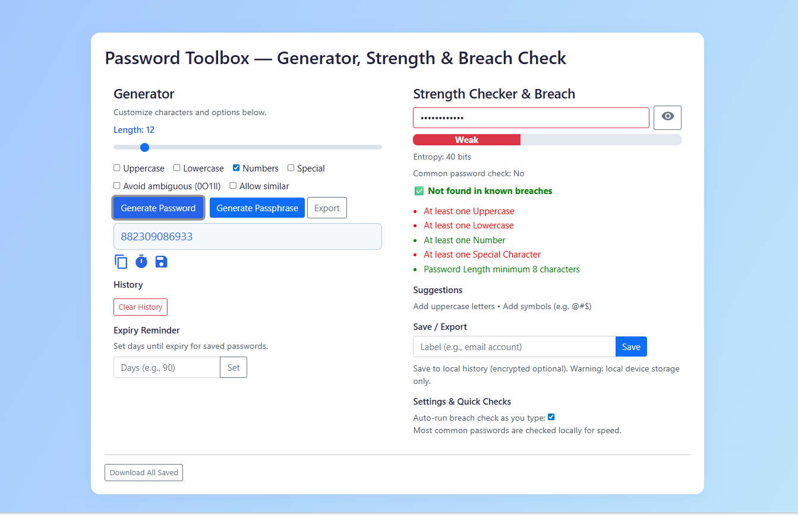

# 🔐 Password Toolbox

A modern, feature-rich **Password Generator & Strength Checker** web app. Instantly generate secure passwords, check their strength, and ensure they're not found in known data breaches—all in a beautiful, responsive interface.



---

## ✨ Features

- **Random Password Generator**  
  Generate strong passwords with customizable length and character sets (uppercase, lowercase, numbers, special characters, avoid ambiguous).

- **Passphrase Generator**  
  Create easy-to-remember, secure passphrases.

- **Password Strength Meter**  
  Real-time feedback with visual meter and actionable suggestions.

- **Breach Check (HaveIBeenPwned)**  
  Instantly check if your password has appeared in public data breaches (privacy-friendly k-anonymity API).

- **Entropy & Common Password Detection**  
  See entropy bits and get warned about common passwords.

- **Password History & Export**  
  Save, label, and export your generated passwords. Set expiry reminders.

- **Dark Mode**  
  Beautiful light & dark themes with one-click toggle (remembers your preference).

- **Mobile Friendly**  
  Responsive design for all devices.

---

## 🚀 Quick Start

1. **Clone or Download**
   ```sh
   git clone https://github.com/yourusername/Passwors-generator-and-password-strength-checker.git
   ```
2. **Open `index.html` in your browser.**  
   No build step, no dependencies—just pure HTML, CSS, and JavaScript.

---

## 📸 Screenshots


---

## 🛡️ Security & Privacy

- All password generation and strength checking is done **locally in your browser**.
- Breach checks use [HaveIBeenPwned's k-anonymity API](https://haveibeenpwned.com/API/v3#SearchingPwnedPasswordsByRange) (your full password is never sent).
- No analytics, no tracking, no data leaves your device.

---

## 🧩 Tech Stack

- HTML5, CSS3 (Bootstrap 5, custom styles)
- Vanilla JavaScript (ES6+)
- [HaveIBeenPwned API](https://haveibeenpwned.com/API/v3#SearchingPwnedPasswordsByRange)

---

## 🙌 Credits

- Inspired by [HaveIBeenPwned](https://haveibeenpwned.com/), [zxcvbn](https://github.com/dropbox/zxcvbn), and the open source community.
- UI icons from [Google Material Icons](https://fonts.google.com/icons).

---


## ⭐️ Star this repo if you find it useful!

---
